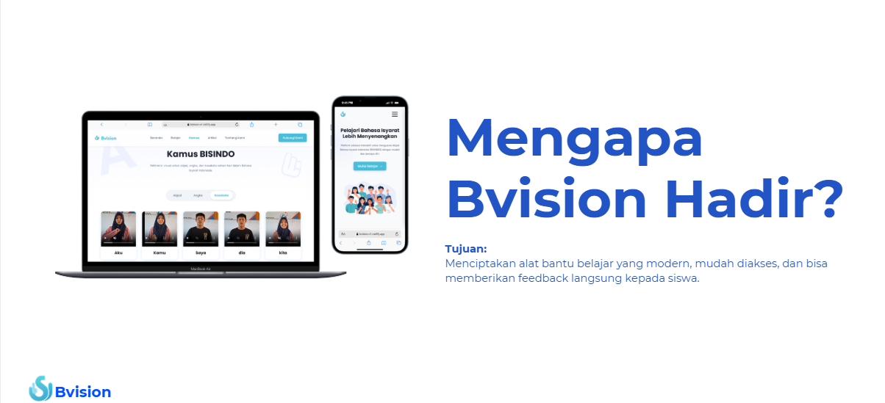

# Bvision — Platform Belajar Abjad BISINDO Interaktif

Bvision adalah aplikasi web edukasi berbasis kecerdasan buatan yang memungkinkan pengguna mempelajari **Abjad Bahasa Isyarat Indonesia (BISINDO)** secara interaktif dan real-time menggunakan kamera perangkat mereka.

---



## Daftar Isi

- [Deskripsi Proyek](#deskripsi-proyek)
- [Fitur Utama](#fitur-utama)
- [Teknologi yang Digunakan](#teknologi-yang-digunakan)
- [Arsitektur Sistem](#arsitektur-sistem)
- [Struktur Proyek](#struktur-proyek)
- [Prasyarat](#prasyarat)
- [Cara Menjalankan](#cara-menjalankan)
- [Variabel Lingkungan](#variabel-lingkungan)
- [Deployment](#deployment)

---

## Deskripsi Proyek

Bvision lahir dari keyakinan bahwa teknologi dapat menjadi jembatan untuk komunikasi yang lebih inklusif. Dengan memanfaatkan computer vision dan machine learning, aplikasi ini mendeteksi gerakan tangan pengguna melalui webcam secara langsung dan menerjemahkannya menjadi huruf abjad BISINDO — tanpa perlu perangkat tambahan apa pun.

---

## Fitur Utama

| Fitur | Deskripsi |
|---|---|
| **Deteksi Bebas** | Arahkan tangan ke kamera; sistem mengenali dan menampilkan huruf yang diperagakan secara real-time |
| **Mode Ujian** | Sistem memberi tantangan huruf secara acak; pengguna harus memeragakannya dan mendapat umpan balik langsung |
| **Kamus BISINDO** | Referensi visual lengkap untuk abjad, angka, dan kosakata sehari-hari dilengkapi gambar dan video |
| **Artikel** | Kumpulan wawasan dan cerita seputar bahasa isyarat Indonesia dan budaya Tuli |
| **Responsif** | Tampilan menyesuaikan antara desktop dan perangkat mobile |

---

## Teknologi yang Digunakan

### Backend
| Teknologi | Versi | Kegunaan |
|---|---|---|
| Python | 3.12 | Bahasa pemrograman utama |
| FastAPI | ≥ 0.141 | Framework web & WebSocket server |
| MediaPipe | 0.10.21 | Deteksi dan pelacakan landmark tangan |
| Scikit-learn | 1.7.2 | Model klasifikasi abjad |
| OpenCV (headless) | 4.10.0 | Pemrosesan gambar dari frame kamera |
| Uvicorn | ≥ 0.52 | ASGI server |
| joblib | ≥ 1.5 | Memuat model `.pkl` yang telah dilatih |

### Frontend
| Teknologi | Versi | Kegunaan |
|---|---|---|
| React | 19 | Library antarmuka pengguna |
| React Router DOM | 7 | Navigasi halaman (SPA) |
| WebSocket API | (native browser) | Komunikasi real-time ke backend |

---

## Arsitektur Sistem

```
┌──────────────────────────────────────────────┐
│                  Browser                      │
│                                               │
│  Webcam → Canvas → JPEG blob                  │
│       │                                       │
│       └──── WebSocket (ws://.../ws) ──────────┤
└──────────────────────────────────────────────┘
                        │
                        ▼
┌──────────────────────────────────────────────┐
│              FastAPI Backend                  │
│                                               │
│  receive_bytes()                              │
│       ↓                                       │
│  OpenCV decode → RGB frame                    │
│       ↓                                       │
│  MediaPipe Hands → 21 landmark × 2 tangan     │
│       ↓                                       │
│  84 fitur (x, y) + padding                   │
│       ↓                                       │
│  StandardScaler → model.predict()             │
│       ↓                                       │
│  send_text(huruf)                             │
└──────────────────────────────────────────────┘
```

Frame kamera dikirim setiap **400 ms** via WebSocket sebagai JPEG blob (kualitas 50%). Backend membalas dengan satu karakter huruf hasil prediksi (atau `"Tidak Terdeteksi"` jika tangan tidak ditemukan).

---

## Struktur Proyek

```
bvision/
├── backend/
│   ├── main.py               # Entry point — FastAPI + WebSocket endpoint
│   ├── main2.py              # Versi eksperimen (model alternatif)
│   ├── models/
│   │   ├── model_new.pkl   # Model klasifikasi abjad (aktif)
│   │   └── scaler_new.pkl  # StandardScaler untuk model aktif
│   ├── Dockerfile
│   ├── nixpacks.toml         # Konfigurasi deployment Railway
│   └── pyproject.toml
│
└── frontend/
    └── src/
        ├── pages/
        │   ├── BerandaPage.js        # Halaman utama
        │   ├── BelajarPage.js        # Ruang belajar (kamera + mode)
        │   ├── KamusPage.js          # Kamus visual BISINDO
        │   ├── ArtikelPage.js        # Daftar artikel
        │   ├── ArticleDetailPage.js  # Detail artikel
        │   ├── TentangKamiPage.js    # Halaman tentang
        │   ├── TentangBisindoPage.js # Penjelasan BISINDO
        │   └── HubungiKamiPage.js    # Kontak
        ├── components/
        │   ├── VIdeoDisplay.js   # Komponen tampilan webcam
        │   ├── Controls.js       # Tombol mulai/hentikan kamera
        │   ├── Tabs.js           # Tab mode belajar
        │   ├── FreeDetectPane.js # Panel hasil deteksi bebas
        │   ├── ExamPane.js       # Panel mode ujian
        │   ├── DictionaryPane.js # Panel kamus di halaman belajar
        │   ├── InstructionModal.js
        │   ├── Navbar.js
        │   └── Footer.js
        ├── hooks/
        │   └── useWindowSize.js  # Hook deteksi lebar layar (mobile/desktop)
        └── data/
            ├── articles.js       # Data konten artikel
            └── dictionaryData.js # Data kamus (abjad, angka, kosakata)
```

---

## Prasyarat

Pastikan perangkat Anda telah menginstal:

- **Python** 3.12+
- **uv** (package manager Python) — atau `pip` biasa
- **Node.js** 18+ dan **npm**
- Webcam (kamera depan/belakang)
- Browser modern (Chrome, Firefox, Edge)

---

## Cara Menjalankan

### 1. Clone Repositori

```bash
git clone <url-repositori>
cd bvision
```

---

### 2. Jalankan Backend

```bash
cd backend
```

**Menggunakan `uv` (direkomendasikan):**

```bash
uv sync
uv run uvicorn main:app --host 0.0.0.0 --port 8000
```

**Menggunakan `pip` + `venv`:**

```bash
python -m venv .venv
source .venv/bin/activate        # Windows: .venv\Scripts\activate
pip install -r requirements.txt  # atau: pip install .
uvicorn main:app --host 0.0.0.0 --port 8000
```

Backend akan berjalan di `http://localhost:8000`. WebSocket tersedia di `ws://localhost:8000/ws`.

> **Catatan:** Backend membutuhkan pustaka sistem `libgl1` dan `libglib2.0-0` untuk OpenCV. Di Ubuntu/Debian jalankan `sudo apt-get install libgl1 libglib2.0-0`.

---

### 3. Jalankan Frontend

Buka terminal baru:

```bash
cd frontend
npm install
npm start
```

Aplikasi akan terbuka secara otomatis di `http://localhost:3000`.

---

### 4. Penggunaan Aplikasi

1. Buka `http://localhost:3000` di browser.
2. Navigasi ke halaman **Belajar**.
3. Klik **"Mulai Kamera"** dan izinkan akses kamera saat diminta browser.
4. Pilih mode:
   - **Deteksi Bebas** — peragakan huruf abjad, hasil prediksi muncul langsung.
   - **Mode Ujian** — sistem menampilkan huruf tantangan; peragakan dengan benar untuk lanjut ke soal berikutnya.
5. Klik **"Hentikan Kamera"** untuk mengakhiri sesi.

---

## Variabel Lingkungan

### Frontend

Buat file `.env` di folder `frontend/` jika ingin mengganti URL backend (misalnya saat deploy):

```
REACT_APP_WS_URL=wss://domain-backend-anda.com/ws
```

Jika variabel ini tidak diset, frontend akan terhubung ke `ws://localhost:8000/ws` secara default.

---

## Deployment

### Backend (Railway / Docker)

Proyek sudah menyertakan `Dockerfile` dan `nixpacks.toml` untuk deployment di [Railway](https://railway.app).

```bash
# Build Docker image secara lokal
cd backend
docker build -t bvision-backend .
docker run -p 8000:8000 bvision-backend
```

### Frontend (Vercel / Netlify / Static Hosting)

```bash
cd frontend
npm run build
```

Folder `build/` yang dihasilkan dapat di-deploy ke layanan hosting statis mana pun. Pastikan variabel `REACT_APP_WS_URL` diset ke URL backend produksi sebelum build.

---

## Pengembang

**Abrar Wahid**  
Mahasiswa Informatika | AI/ML Engineer & Software Engineer  
GitHub: [github.com/abrarwahidd](https://github.com/abrarwahidd)
